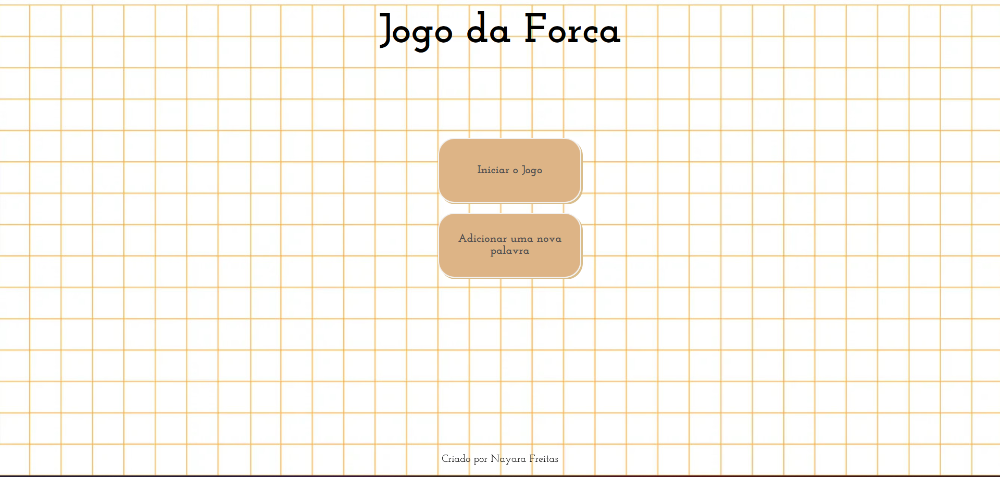
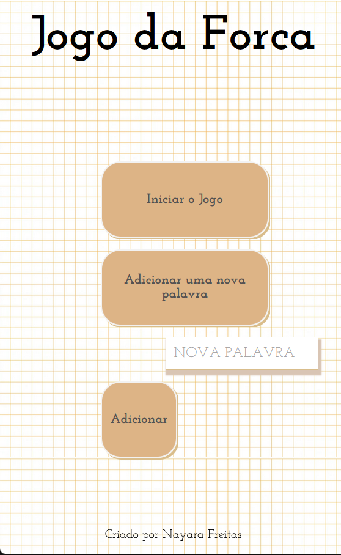
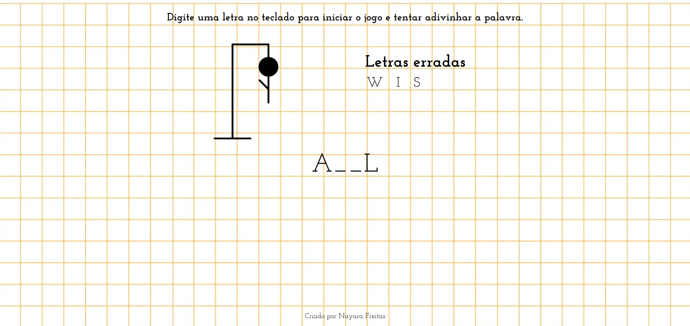

<h1 align="center"> Jogo da Forca </h1>

*Imagem da tela inicial*

<h2>Descrição do projeto: </h2>

Projeto desenvolvido como segundo challenge do Oracle-One e Alura. O Jogo da forca é um jogo, onde as pessoas devem usar 
as teclas do teclado para tentar adivinhar a palavra sorteada.

O jogo permite a inclusão de palavras novas a cada rodada para que está possa participar do sorteio da palavra a ser
adivinhada.

# :hammer: Funcionalidades do projeto

- `Funcionalidade 1`: Utilizando o botão adicionar é possível incluir uma nova palavra;

*Imagem da tela para adicionar uma nova palavra*

- `Funcionalidade 2`: O jogador tem seis tentativas para acertar a palavra sorteada;

*Imagem da tela do jogo em andamento*

:snowflake: Utilizando:
**JavaScript**
**HTML**
**CSS**

